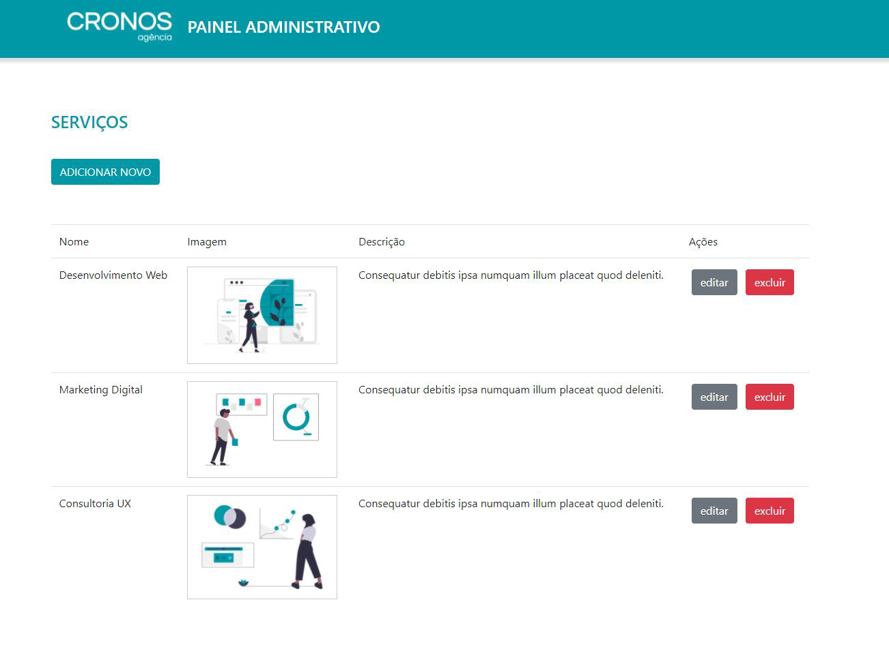

# DESAFIO EM GRUPO - Agência Cronos 

<p align = "center"> Projeto em Grupo - Gama Academy 👊 </p>


# Sobre 

  <p> Esse projeto foi desenvolvido em grupo, com o intuito de dar continuidade ao desenvolvimento da página, nós implementamos a funcionalidade CRUD (criar, editar, atualizar e deletar) e renderizarmos a página com o React. </p>


# Ilustração do projeto 
   <h1 align = "center"> </h1>

   

 # Tecnologias

  As seguintes tecnologias foram usadas na construção do projeto em questão:

  - CSS3
  - HTML5
  - JAVASCRIPT
  - REACT


# Pré-requisitos 

No primeiro momento, você vai precisar ter instalado em sua máquina as seguintes ferramentas 🛠: 
<a href="https://git-scm.com"> Git </a>.
 Além disso é bom ter um editor para trabalhar com o código, recomendo o: <a href="https://code.visualstudio.com/"> VS Code </a>.

### 👨‍💻 Rodando o código

 ```bash
 # Clone este repositório
 $ git clone <https://github.com/davidbechi/Desafio-AgenciaCronos.git>

 # Acesse a pasta do projeto no terminal/cmd
 $ cd Desafio-AgenciaCronos

 # Instale as dependências
 $ yarn 

 # Execute a aplicação em modo de desenvolvimento
 $ yarn start
 ```


## Autores 

Feito por 👨‍💻 

| [<br><sub>Bruna Duarte</sub>](https://github.com/BrunaDuarte-3321) |  [<br><sub>Raphael Muniz</sub>](https://github.com/raphaelsmuniz) |  [<br><sub>David Bechi</sub>](https://github.com/davidbechi) |
| :---: | :---: | :---: |
